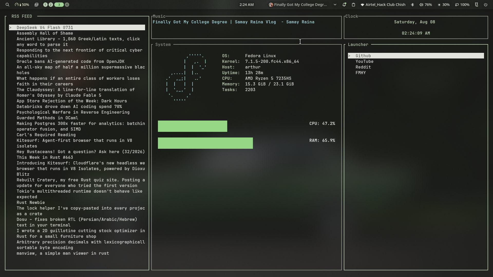

# StarTUI
A cool minimal startpage for your terminal, written in Rust!



## Features

- Custom RSS Feeds
- Add custom website bookmarks
- Minimal Sys info, inspired from fastfetch!

## Installation

You can install the build from cargo!
```
cargo install startui
```

Or.. maybe I will upload Binary in GITHUB Releases too :3

### Prerequisites
You need `fastfetch` installed for getting OS logo, TUI will still run fine, but you won't get cool Logo in TUI

## Development

Thanks for taking interest in trying to develop your version of StarTUI!
Follow the below steps for getting started!

Clone and enter the source directory
```
git clone https://github.com/chishxd/startui.git && cd startui
```

Check if it works ¯\\_(ツ)_/¯
```
cargo run
```


# License
I am using MIT License for this project :D
